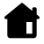
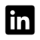

### 👋 Hi there, I'm Ruan

- 🧑‍💻 Data scientist who builds solutions wih ML, GenAI, and agents
- 🧃 Fuelled by curiosity, code, and caffeine
- 🌱 Currently exploring LLMs, evals, and AI observability

### 🛠 My Toolbox

<!--
More badges from: https://dev.to/envoy_/150-badges-for-github-pnk

-->

### 📊 GitHub Stats

### 🌐 Connect with Me

<!--
Sponsor links

-->

<!--
**ruankie/ruankie** is a ✨ _special_ ✨ repository because its `README.md` (this file) appears on your GitHub profile.

Here are some ideas to get you started:

- 🔭 I’m currently working on ...
- 🌱 I’m currently learning ...
- 👯 I’m looking to collaborate on ...
- 🤔 I’m looking for help with ...
- 💬 Ask me about ...
- 📫 How to reach me: ...
- 😄 Pronouns: ...
- ⚡ Fun fact: ...

Use these icons:
https://icons8.com/icon/set/social-media/ios-glyphs
save .svg with size 50x50
-->
